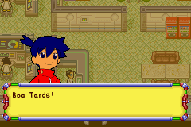
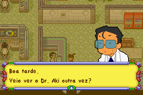
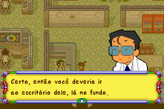

# Tradução PT-BR - Medabots: Metabee Version (GBA)

Este repositório documenta o processo e as ferramentas utilizadas no projeto de tradução da ROM espanhola do jogo Medabots (GBA) para o Português do Brasil.

## Dados

**Medabots - Metabee 2002 (Versão espanhola)**

ROM: Medabots - Metabee (Spain).gba com CRC: 7E907EC8

**Status do Projeto:** 25% Aproximadamente - Em andamento - versão 0.9

## Lançamentos (Downloads)

Uma versão beta do patch `.ips` está disponível para testes. Para aplicar o patch, você precisará da ROM original (versão espanhola) e de uma ferramenta como o Lunar IPS.

**➡️ [Baixar a Versão Beta na página de Releases](https://github.com/rodrigo-frances/medabots-metabee-pt-br/releases)**

## Objetivo

O objetivo deste projeto é tornar este clássico do GBA acessível para a comunidade de fãs brasileiros, com uma tradução que busca adaptar os diálogos para a dublagem clássica do anime exibido no Brasil.

## Ferramentas Utilizadas

* **Editor Hexadecimal:** [WindHex32](https://www.romhacking.net/utilities/291/)
* **Busca Relativa:** [Monkey-Moore](https://www.romhacking.net/utilities/513/)
* **Ferramentas de Romhacking:** [gba-global-repointer](https://github.com/rodrigo-frances/gba-global-repointer) - Recalculador de ponteiros criada para o projeto mas que pode ser usada em outros jogos.

## Desafios Técnicos

Durante o projeto, um dos maiores obstáculos foi a necessidade de realocar os diálogos na memória da ROM, o que quebrava os ponteiros originais. A solução envolveu:

1.  Analisar a estrutura de dados da ROM para entender como os ponteiros eram armazenados.
2.  Encontrar a fonte do jogo e alterar para acrescentar acentuação usada em PT-BR.
3.  Desenvolver uma ferramenta em Python para mapear os ponteiros antigos para os novos endereços.
4.  Executar uma busca e substituição global para corrigir todas as referências na ROM.

Ainda há o desafio de extrair os gráficos comprimidos e edita-los.

## Galeria de Exemplos

Aqui estão alguns exemplos do trabalho de tradução e adaptação:

